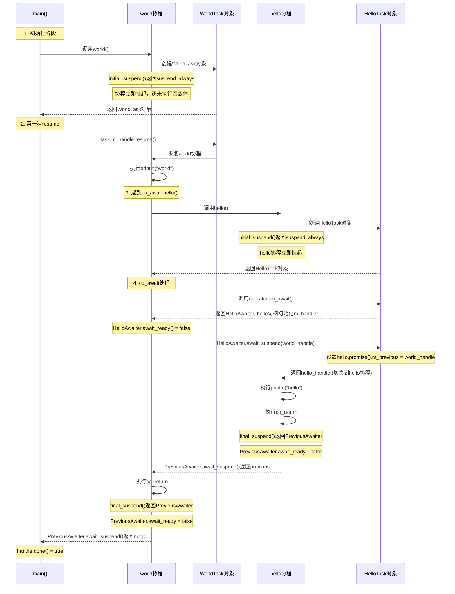

```mermaid
sequenceDiagram
    participant Main as main()
    participant WorldCoro as world协程
    participant WorldTask as WorldTask对象
    participant HelloCoro as hello协程
    participant HelloTask as HelloTask对象

    Note over Main: 1. 初始化阶段
    Main->>WorldCoro: 调用world()
    WorldCoro->>WorldTask: 创建WorldTask对象
    Note over WorldCoro: initial_suspend()返回suspend_always
    Note over WorldCoro: 协程立即挂起，还未执行函数体
    WorldTask-->>Main: 返回WorldTask对象

    Note over Main: 2. 第一次resume
    Main->>WorldTask: task.m_handle.resume()
    WorldTask->>WorldCoro: 恢复world协程
    WorldCoro->>WorldCoro: 执行println("world")
    
    Note over WorldCoro: 3. 遇到co_await hello()
    WorldCoro->>HelloCoro: 调用hello()
    HelloCoro->>HelloTask: 创建HelloTask对象
    Note over HelloCoro: initial_suspend()返回suspend_always
    Note over HelloCoro: hello协程立即挂起
    HelloTask-->>WorldCoro: 返回HelloTask对象
    
    Note over WorldCoro: 4. co_await处理
    WorldCoro->>HelloTask: 调用operator co_await()
    HelloTask-->>WorldCoro: 返回HelloAwaiter, hello句柄初始化m_handler
    Note over WorldCoro: HelloAwaiter.await_ready() = false
    WorldCoro->>HelloTask: HelloAwaiter.await_suspend(world_handle)
    Note over HelloTask: 设置hello.promise().m_previous = world_handle
    HelloTask-->>HelloCoro: 返回hello_handle (切换到hello协程)
    HelloCoro->>HelloCoro: 执行println("hello")
    HelloCoro->>HelloCoro: 执行co_return
    Note over HelloCoro: final_suspend()返回PreviousAwaiter
    Note over HelloCoro: PreviousAwaiter.await_ready = false
    HelloCoro-->>WorldCoro: PreviousAwaiter.await_suspend()返回previous

    WorldCoro->>WorldCoro: 执行co_return
    Note over WorldCoro: final_suspend()返回PreviousAwaiter
    Note over WorldCoro: PreviousAwaiter.await_ready = false
    WorldCoro-->>Main: PreviousAwaiter.await_suspend()返回noop

    Note over Main: handle.done() = true

```
