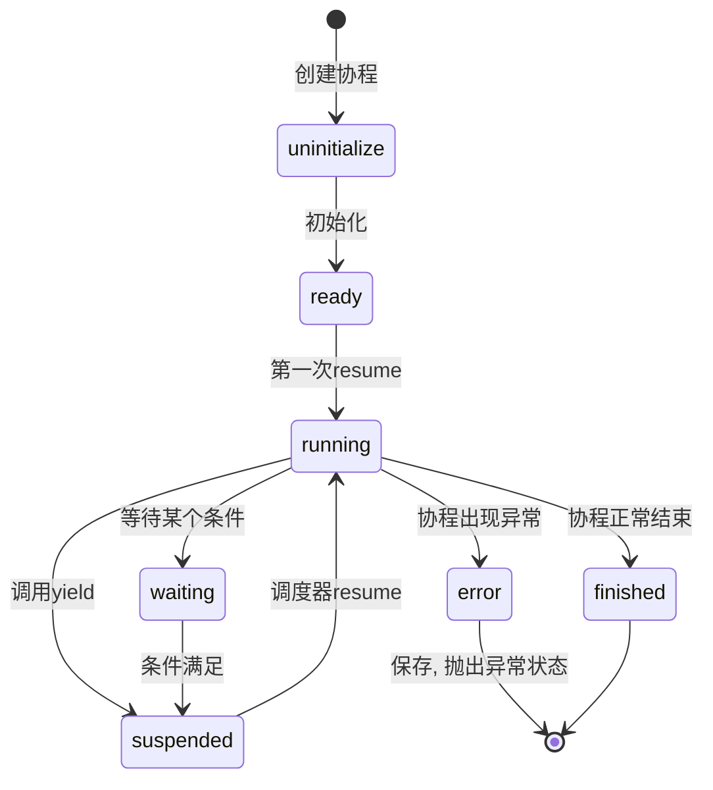

相比于stack/demo/1
1. 添加协程对象嵌套支持
2. 添加类型支持

# issue
1. 构造可能存在问题，引用类型无法作为此模板参数

# TODO
1. CTAD
2. 优化每个coroutine的栈空间占用, 设置栈保护
3. 异常处理需要考虑非异常环境，用宏判断

# 协程状态机

```mermaid
stateDiagram-v2
    [*] --> uninitialize: 创建协程
    uninitialize --> ready: 初始化
    ready --> running: 第一次resume
    running --> suspended: 调用yield
    suspended --> running: 调度器resume
    running --> waiting: 等待某个条件
    waiting --> suspended: 条件满足
    running --> finished: 协程正常结束
    running --> error: 协程出现异常
    error --> [*]: 保存, 抛出异常状态
    finished --> [*]
```